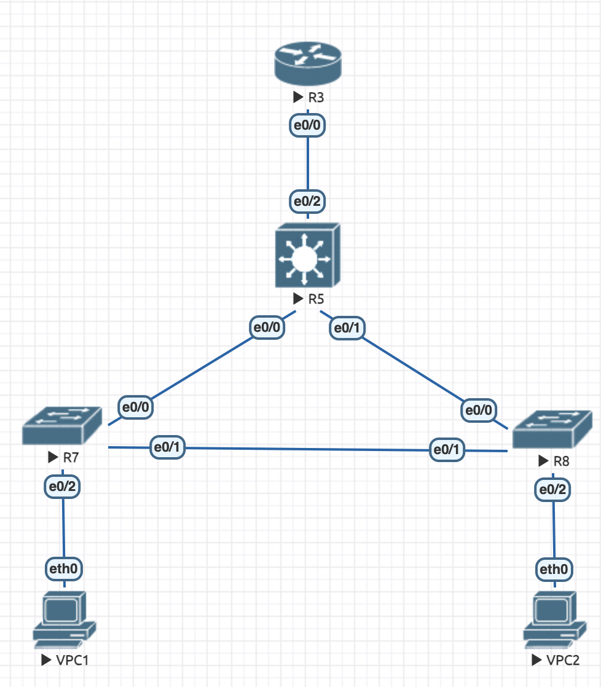
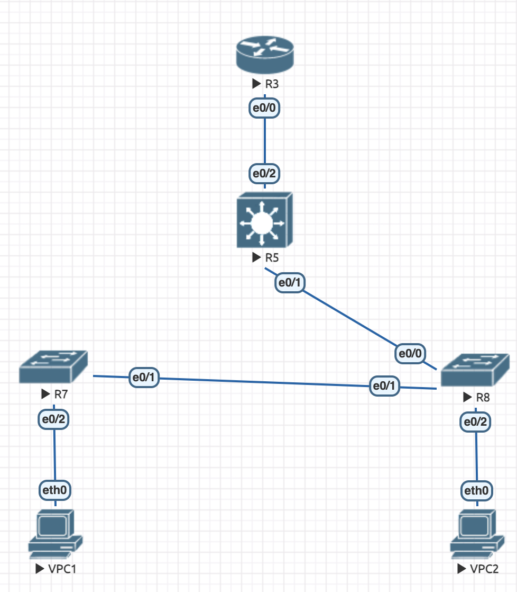

# Полная топология



## VPC1

```
VPCS> ping 10.0.20.1

84 bytes from 10.0.20.1 icmp_seq=1 ttl=255 time=4.927 ms
84 bytes from 10.0.20.1 icmp_seq=2 ttl=255 time=7.167 ms
84 bytes from 10.0.20.1 icmp_seq=3 ttl=255 time=5.277 ms
84 bytes from 10.0.20.1 icmp_seq=4 ttl=255 time=7.639 ms
84 bytes from 10.0.20.1 icmp_seq=5 ttl=255 time=5.153 ms
```

## VPC2

```
VPCS> ping 10.0.10.1

84 bytes from 10.0.10.1 icmp_seq=1 ttl=255 time=6.097 ms
84 bytes from 10.0.10.1 icmp_seq=2 ttl=255 time=5.204 ms
84 bytes from 10.0.10.1 icmp_seq=3 ttl=255 time=5.018 ms
84 bytes from 10.0.10.1 icmp_seq=4 ttl=255 time=4.744 ms
84 bytes from 10.0.10.1 icmp_seq=5 ttl=255 time=6.296 ms
```

# Отключенный интерфейс



## VPC1

```
VPCS> ping 10.0.20.1

84 bytes from 10.0.20.1 icmp_seq=1 ttl=255 time=5.000 ms
84 bytes from 10.0.20.1 icmp_seq=2 ttl=255 time=8.668 ms
84 bytes from 10.0.20.1 icmp_seq=3 ttl=255 time=5.673 ms
84 bytes from 10.0.20.1 icmp_seq=4 ttl=255 time=6.216 ms
84 bytes from 10.0.20.1 icmp_seq=5 ttl=255 time=4.965 ms
```

## VPC2

```
VPCS> ping 10.0.10.1

84 bytes from 10.0.10.1 icmp_seq=1 ttl=255 time=19.093 ms
84 bytes from 10.0.10.1 icmp_seq=2 ttl=255 time=5.893 ms
84 bytes from 10.0.10.1 icmp_seq=3 ttl=255 time=6.485 ms
84 bytes from 10.0.10.1 icmp_seq=4 ttl=255 time=5.027 ms
84 bytes from 10.0.10.1 icmp_seq=5 ttl=255 time=4.856 ms
```
